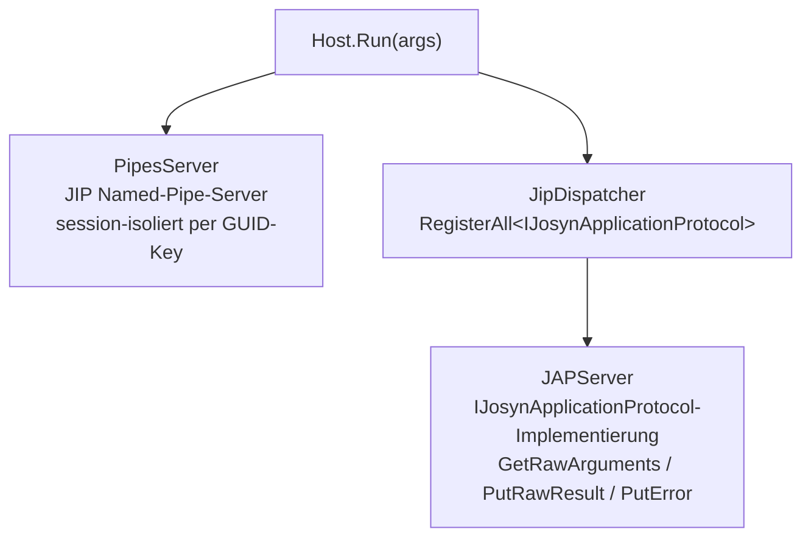

# JOSYN.Jap.JAPServer

Part of the **JOSYN** (JobSystem Next) ecosystem — lives in `josyn-backend` (relocated per ADR-004).

`JOSYN.Jap.JAPServer` ist die **Backend-Server-Exe**. Sie startet den JIP-Named-Pipe-Server,
nimmt JAP-Anfragen von Job-Executables entgegen, dispatcht sie an die
`IJosynApplicationProtocol`-Implementierung und verwaltet den Server-Lifecycle — alles
über das JOSYN-Result-Pattern.

> **Hinweis:** Dies ist eine Executable, keine Bibliothek. Sie wird nicht als NuGet-Paket
> verteilt.

---

## Schnellstart

Der Server wird ausschließlich von `SessionLauncher` gestartet. Beim manuellen Testen
den Aufruf wie folgt nachbilden:

```
JOSYN.Jap.JAPServer.exe JOSYN-START @<path-to-session-start-spec.ini>
```

Die INI-Datei enthält eine serialisierte `SessionStartSpec` (via `PropertyBag`).
Im Demo-Betrieb übernimmt `demo.cmd` das automatisch.

---

## Architektur



**Transport:** `JOSYN.Foundation.JIP` Named Pipes (session-isoliert per GUID-Key).
**Anwendungsprotokoll:** `JOSYN.Jap.Contract.IJosynApplicationProtocol`.
**Dispatch:** `JipDispatcher.RegisterAll<T>` — kein manuelles What-String-Wiring.

---

## Exit-Codes

| Code | Bedeutung |
|---|---|
| `0` | Server erfolgreich terminiert |
| `1` | Fataler Fehler (fehlender Session-Key, IPC-Fehler, unbehandelte Exception) |

---

## Abhängigkeiten

| Paket | Rolle |
|---|---|
| `JOSYN.Foundation.ResultPattern` | Fehler-als-Wert-Pattern durchgängig |
| `JOSYN.Foundation.JIP` | Named-Pipe-IPC-Transport + JIP-Konventions-Layer |
| `JOSYN.Jap.Contract` | `IJosynApplicationProtocol`-Anwendungsprotokoll |
| `JOSYN.Jap.Shared.Log` | `LocalLog` für Protokollierung |

---

## Für Maintainer

### Bauen

```
.local-build\build.cmd          # Release-Build (nur JAPServer)
.local-build\build.cmd Debug    # Debug-Build (nur JAPServer)
```

Alle Lösungen im Repo auf einmal:

```
..\.local-build\build.cmd       # baut JAPServer + alle Backend-Pakete
```

*(Kein `pack.cmd` — dies ist eine Exe, kein NuGet-Paket.)*

### Hinweise

- **Session-Key via JOSYN-START:** Der Aufrufer übergibt `"JOSYN-START @<path>"` als Argumente.
  JAPServer liest die `SessionStartSpec`-Datei, löscht sie sofort und startet den Session-Lifecycle.
- **`FakeReadArgumentsFromFile`** — hardcoded; bewusst, kein Bug.
- **Demo-Session-Key:** `dea5611d-d740-437f-ad93-7a5dc5ae4299` (hardcoded in `launchSettings.json`).
- **Fehlermeldungen sind auf Deutsch** — projekt-weite Konvention.
- **`de-DE` Default-Kultur** — betrifft Zahlen- und Datumsformatierung.
